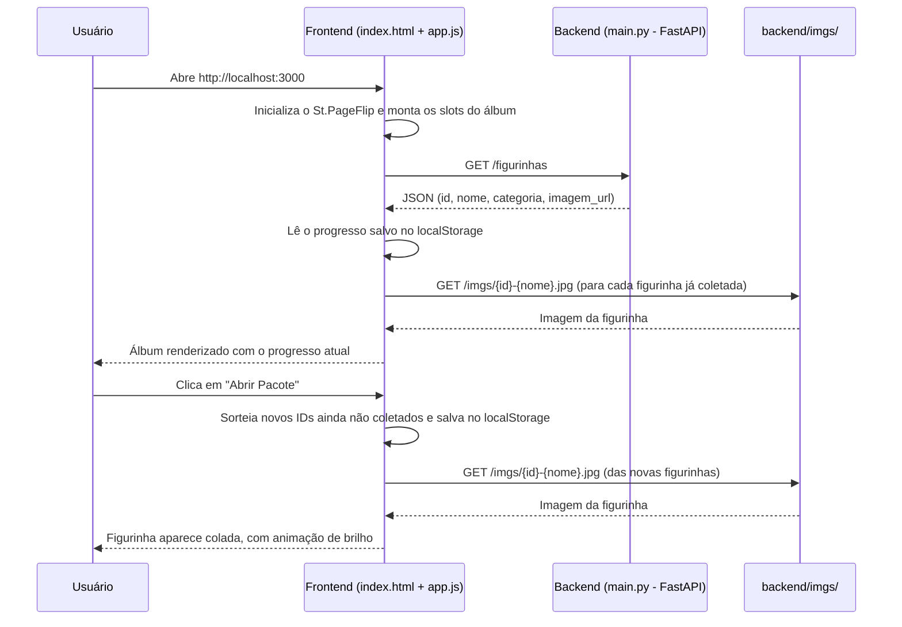

# Stranger Album - Hawkins Edition 🚀


Este projeto é um **Álbum de Figurinhas Digital Interativo** que teve seu desenvolvimento iniciado durante a **Imersão Julho 2026 - Arquitetura Web com IA da Alura** sobre a famosa série da Netflix **Stranger Things**. O projeto simula a experiência realista de folhear um álbum físico, com animações tridimensionais de virada de página, efeitos sonoros gerados em tempo real, um tema visual imersivo em vermelho neon e sombrio, e preenchimento dinâmico de figurinhas através de uma API.

---

## 🎯 Objetivo do Projeto

O objetivo principal é construir uma interface web imersiva e responsiva que conecte um frontend interativo a um backend de API para:
1. **Catalogar e exibir personagens, monstros e locais** da série Stranger Things categorizados por temas (como O Grupo Principal, Adolescentes, Adultos, Criaturas do Outro Lado e Destaques de Hawkins).
2. **Proporcionar uma experiência rica ao usuário** através de animações suaves de virada de página física utilizando a biblioteca `St.PageFlip`.
3. **Gerar efeitos sonoros dinâmicos** de papel usando síntese de áudio nativa do navegador (Web Audio API).
4. **Consumir dados dinamicamente** de um servidor backend FastAPI para carregar e colar as figurinhas nos respectivos slots do álbum.

---

## 📁 Estrutura de Arquivos e Funcionalidades

O projeto é dividido em duas pastas: `frontend/`, com a interface interativa, e `backend/`, com a API que fornece os dados e as imagens das figurinhas.

### 🗂️ Categorias do Álbum

| Categoria | Página(s) | Qtd. Figurinhas | IDs | Descrição |
|---|---|---|---|---|
| **THE PARTY** | Pág. 1 | 6 | `#01`–`#06` | O grupo principal de Hawkins: Mike, Dustin, Eleven, Will, Lucas e Max |
| **THE TEENS** | Pág. 2 | 5 | `#07`–`#11` | Adolescentes de Hawkins: Nancy, Jonathan, Steve, Robin e Eddie Munson |
| **THE ADULTS** | Pág. 3 | 5 | `#12`–`#16` | Adultos e protetores: Joyce, Hopper, Murray, Bob e Karen Wheeler |
| **MONSTERS** | Pág. 4 | 5 | `#17`–`#21` | Ameaças do Mundo Invertido: Demogorgon, Demodogs, Mind Flayer, Vecna e Demobats |
| **HAWKINS** | Pág. 5–6 | 9 | `#22`–`#30` | Cenários e locais icônicos: Laboratório, Porão dos Wheeler, Starcourt Mall, Scoops Ahoy, entre outros |
| **Você** | Pág. 6 | — | `#31` | Slot bônus: reservado para o usuário colar a própria foto — não faz parte do catálogo da API |

**Total: 30 figurinhas colecionáveis** (sorteadas via o sistema de pacotes) **+ 1 slot pessoal**.

### 1. [index.html](frontend/index.html)
Contém a estrutura semântica em HTML5 da aplicação.
*   **Controles de Interface:** Botão de controle de som (ativar/desativar mute) e setas de navegação para alternar entre as páginas.
*   **Estrutura do Álbum (`#book`):** Container principal onde cada página (`.page`) é definida, contendo a capa, páginas temáticas, slots de figurinhas e contracapa.
*   **Páginas Temáticas:**
    *   **Capa:** Título estilizado ("STRANGER ALBUM") com efeito *glitch*, mini-cards flutuantes com as iniciais dos personagens (MK, EL, ST) e uma esfera tecnológica 3D brilhante central com anéis giratórios.
    *   **Página 1 (THE PARTY):** O grupo de Hawkins (Mike, Dustin, Eleven, Will, Lucas e Max).
    *   **Página 2 (THE TEENS):** Adolescentes de Hawkins (Nancy, Jonathan, Steve, Robin e Eddie Munson).
    *   **Página 3 (THE ADULTS):** Adultos e protetores (Joyce, Hopper, Murray, Bob e Karen Wheeler).
    *   **Página 4 (MONSTERS):** Ameaças do Mundo Invertido (Demogorgon, Democães, Devorador de Mentes, Vecna e Demobats).
    *   **Páginas 5 e 6 (HAWKINS):** Cenários, mistérios e elementos icônicos de Hawkins (Laboratório, Porão, Starcourt Mall, Scoops Ahoy, etc.).
    *   **Contracapa:** Resumo do projeto temático, colagem de logos e um código de barras simulado.
*   **Dependências:** Carrega a biblioteca externa `page-flip.browser.min.js` via CDN e o script local `app.js`.

### 2. [style.css](frontend/style.css)
Responsável por toda a identidade visual premium e responsiva da aplicação.
*   **Design System:** Define variáveis CSS (`:root`) com a nova paleta de cores baseada em variações de vermelho e laranja (vermelhos profundos, tons neon/laranja e preto espacial).
*   **Layout Moderno:** Utiliza CSS Flexbox e Grid para centralizar o álbum e organizar os slots de figurinhas de maneira harmônica.
*   **Efeitos e Transições:**
    *   Gradientes radiais para simular profundidade e escuridão no fundo (`body`).
    *   Estilização dos botões flutuantes (som e setas de navegação) com efeito de *glassmorphism* (fundo translúcido) e sombras neon no hover.
    *   Efeito de texto *glitch* animado para o título da capa.
    *   Slots das figurinhas (`.sticker-slot`) com bordas suaves e transições para exibir a figurinha colada (`.slot-preenchido`).

### 3. [app.js](frontend/app.js)
Controla toda a lógica de interatividade, sintetização de som, progresso da coleção e comunicação assíncrona com o backend.
*   **Inicialização do Álbum:** Instancia a biblioteca `St.PageFlip` definindo as dimensões, limites de zoom, sombras físicas e tempo de transição das páginas.
*   **Gestos Personalizados de Arraste (Drag & Touch):** Escuta eventos de mouse e toque para permitir que o usuário arraste os cantos das páginas para folhear manualmente de forma fluida.
*   **Navegação e Atalhos:** Mapeia botões de avançar/retroceder e as teclas do teclado (seta esquerda e direita) para comandar o álbum. Oculta os botões nas extremidades (capa e contracapa).
*   **Síntese de Áudio (Web Audio API):**
    *   Gera um som de papel folheando dinamicamente em tempo real via código, sem carregar arquivos de áudio externos pesados.
    *   Utiliza ruído branco (*white noise*) modulado por uma curva de volume (*envelope*) e filtros de frequências dinâmicas (*bandpass* e *lowpass*) para simular o atrito e movimento do papel.
    *   A preferência de som ativado/desativado é salva no `localStorage` e persiste entre sessões.
*   **Catálogo e Integração com Backend (`carregarCatalogo`):**
    *   Faz uma requisição assíncrona (`fetch`) para a API rodando em `http://localhost:8000/figurinhas`.
    *   Mapeia as figurinhas retornadas pelo backend pelo seu respectivo ID e localiza o slot HTML correspondente pelo número (ex: `#01` → ID `1`).
    *   Se a API não responder, exibe um banner de erro no topo da tela com um botão "Tentar novamente", em vez de falhar silenciosamente.
*   **Coleção e Sistema de Pacotes (Progresso):**
    *   O álbum começa vazio: nenhuma figurinha vem colada por padrão. O progresso (quais IDs já foram revelados) é salvo no `localStorage` e persiste entre sessões.
    *   O botão **"Abrir Pacote"** sorteia até 5 figurinhas ainda não coletadas e as revela com uma animação de brilho, uma a uma. Um contador (`X/30`) mostra o progresso, e o botão vira "Álbum completo!" quando todas forem coletadas.
    *   Um botão de reset permite reiniciar a coleção (a foto do slot `#31` não é afetada).
    *   Enquanto a imagem de uma figurinha é baixada, o slot exibe um efeito de *shimmer*; ao carregar com sucesso, recebe a classe `.slot-preenchido`.
    *   Os mini-cards flutuantes da capa (`.mini-card`) só trocam as iniciais (MK, EL, ST) pela foto real quando aquele personagem específico (#01, #03 ou #09) já foi coletado.
*   **Foto do Usuário (slot `#31` "Você"):** ao clicar no slot, abre o seletor de arquivos do navegador; a imagem escolhida é redimensionada/comprimida via `<canvas>` e salva como *data URL* no `localStorage`, persistindo entre sessões independentemente do backend estar disponível.

### 4. [main.py](backend/main.py)
API em **FastAPI** responsável por servir os dados e as imagens das figurinhas.
*   **Lista de Figurinhas:** Define os 30 personagens/locais catalogados (id, nome, categoria e URL da imagem), cobrindo as categorias The Party, The Teens, The Adults, Monsters e Hawkins. O slot `#31` ("Você") é proposital: não existe no catálogo da API — no frontend, esse slot é preenchido pelo próprio usuário, que pode clicar nele para colar sua própria foto.
*   **Endpoint `GET /figurinhas`:** Retorna a lista completa em JSON para o frontend consumir.
*   **Arquivos Estáticos:** Monta a pasta `backend/imgs/` na rota `/imgs`, servindo as imagens (nomeadas de `01-mike-wheeler.jpg` a `30-palace-arcade.jpg`, numeradas de acordo com o slot correspondente no álbum).
*   **CORS:** Libera requisições de qualquer origem (`allow_origins=["*"]`) para que o frontend, rodando em uma porta diferente (ex: `http://localhost:3000`), consiga consumir a API sem bloqueios do navegador.

### 🔄 Fluxo da Estrutura do Projeto



Resumindo: o `index.html` monta a estrutura estática do álbum, o `app.js` busca o catálogo no backend e decide **o que mostrar** com base no progresso salvo localmente, e o `main.py` só entra em cena para fornecer os dados (`/figurinhas`) e servir as imagens (`/imgs/*.jpg`) — toda a lógica de coleção, pacotes e persistência acontece no navegador, via `localStorage`.

---

## 🛠️ Como Executar o Projeto

Para visualizar a aplicação completa com as figurinhas preenchidas, você precisa rodar o backend e o frontend simultaneamente (em dois terminais).

### 1. Rodar o Backend
```bash
# Entre na pasta do backend
cd backend

# Instale as dependências (se ainda não tiver um ambiente configurado)
pip install fastapi "uvicorn[standard]"

# Inicie o servidor uvicorn
uvicorn main:app --reload
```
O servidor da API estará rodando em `http://localhost:8000`. Teste em `http://localhost:8000/figurinhas`.

### 2. Rodar o Frontend
Para uma experiência de desenvolvimento livre de restrições de CORS locais:
1. Use extensões como "Live Server" no VS Code, ou
2. Utilize um servidor web local simples pelo terminal na raiz da pasta `frontend/`:
   ```bash
   cd frontend
   python -m http.server 3000
   ```
   Em seguida, acesse `http://localhost:3000` no seu navegador.

> Abrir `frontend/index.html` diretamente pelo navegador (`file://`) **não funciona** para carregar as figurinhas: o `fetch` para a API é bloqueado nesse esquema. Sempre sirva o frontend por um servidor HTTP local.

---

## 🚧 Próximos Passos

Ideias para futuras versões do projeto:

*   **Deploy Público:** hospedar o backend (ex: Render, Railway ou Fly.io) e o frontend (ex: Vercel, Netlify ou GitHub Pages), disponibilizando um link público do álbum em vez de depender de `localhost`.
*   **Testes Automatizados:** `pytest` para o endpoint `/figurinhas` do backend, e testes end-to-end (Playwright) cobrindo os fluxos principais do frontend (abrir pacote, persistência de progresso, upload de foto).
*   **CI no GitHub Actions:** rodar lint e os testes automaticamente a cada push/PR.
*   **PWA (Progressive Web App):** `manifest.json` + service worker para instalar o álbum como app e permitir uso offline.
*   **Progresso Sincronizado:** persistir a coleção em um backend com banco de dados (SQLite) e um identificador de usuário, permitindo continuar o álbum em outro dispositivo — hoje o progresso vive só no `localStorage` do navegador.
*   **Estatísticas por Categoria:** exibir o progresso também por tema (ex: "The Party: 4/6"), além do contador geral.
*   **Compartilhamento:** gerar uma imagem (via `canvas`) de uma página ou do álbum completo para compartilhar em redes sociais.
*   **Acessibilidade:** `aria-live` para anunciar figurinhas reveladas, navegação por teclado nos controles de pacote/reset, e revisão de contraste.
*   **Otimização de Imagens:** converter as imagens de `backend/imgs/` para WebP e aplicar `loading="lazy"` nas figurinhas.

---

## 👤 Autoria

Desenvolvido por [@itsmariah](https://github.com/itsmariah).
